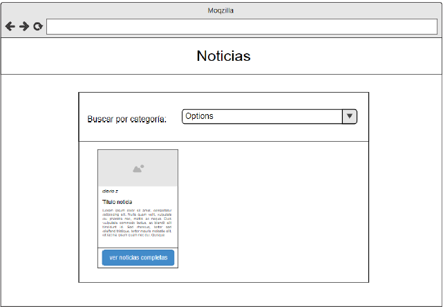

# Ejercicios React - Rolling Code School 
Prácticas con componentes, ciclo de vida del componente, eventos etc.

## Ejercicio N°11: Web de noticias - Dificultad: 🟢🟡
Crear una aplicación web con react, que consuma la API provista por
[NewsAPI](https://newsapi.org/) o [NewsData](https://newsdata.io/docs), la aplicacion debe tener la siguiente estructura:

### Componentes:
1. Título
2. Formulario (este contiene el select)
3. ListaNoticias
4. Noticia

Desde el select superior, debe poder elegir las diferentes categorías (provistas por
la api ver en la documentación) y cargar en cards las mismas.

## Web de noticias v2
Modifica la web anterior permitiendo que el usuario seleccione el país y la
categoría de las noticias que quiere ver.

## Librerías 📚
-  [React](https://react.dev/)
-  [React Bootstrap](https://react-bootstrap.netlify.app/)
-  [React Hook Form](https://react-hook-form.com/)
-  [Sweetalert2](https://sweetalert2.github.io/)

## Link de Deploy 🌐
- [Netlify](https://lucasecapdevila-tpn11-12react76i.netlify.app/)

## Instalación ⚙️
1. Clonar el repositorio usando el comando `git clone`.
2. Buscar el nombre del repositorio clonado en el explorador de archivos.
3. Instalar las dependencias usando el comando `npm install`.

## Uso ✍️
Para ver el ejercicio en el navegador, ejecutar el comando `npm run dev`.

## Autor 👷‍♂️
- Capdevila Lucas
